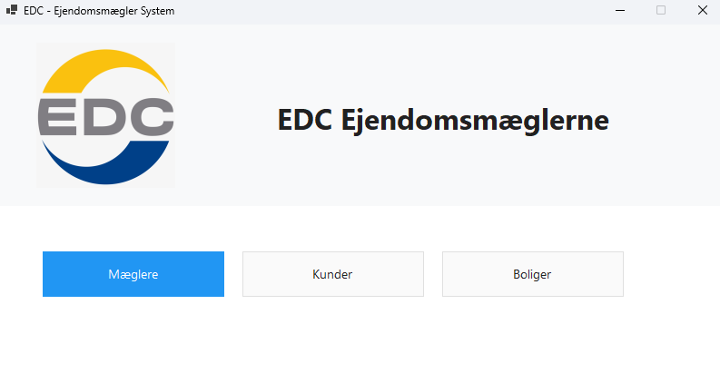
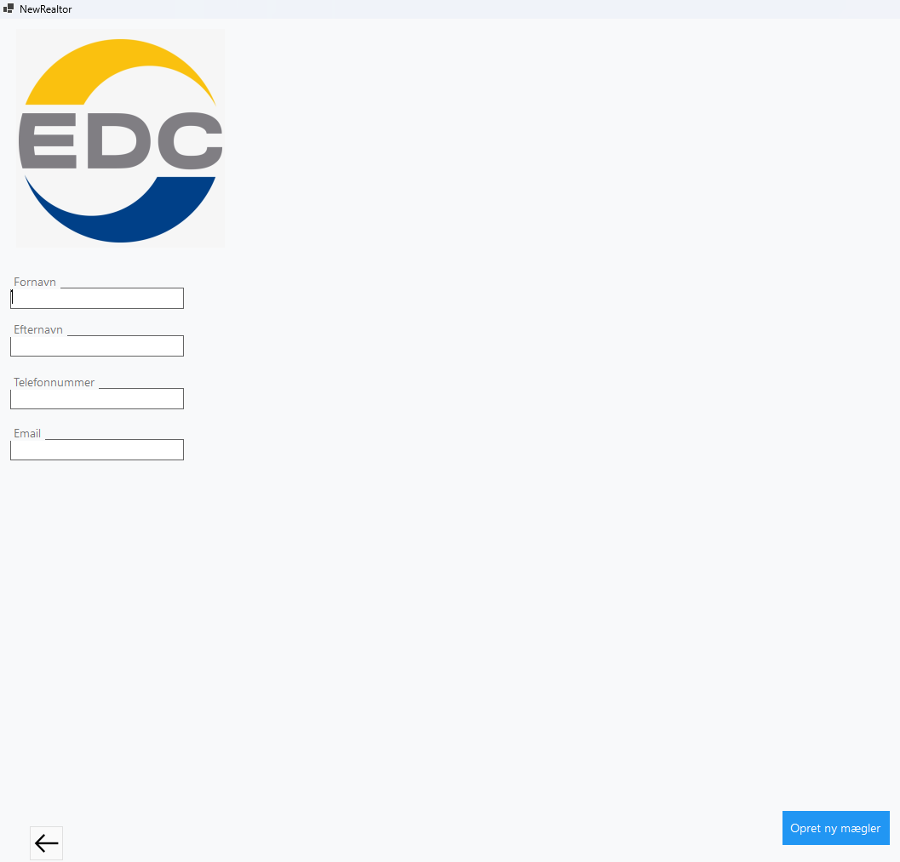
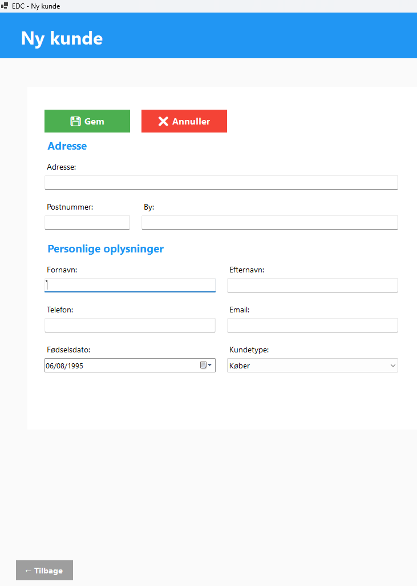
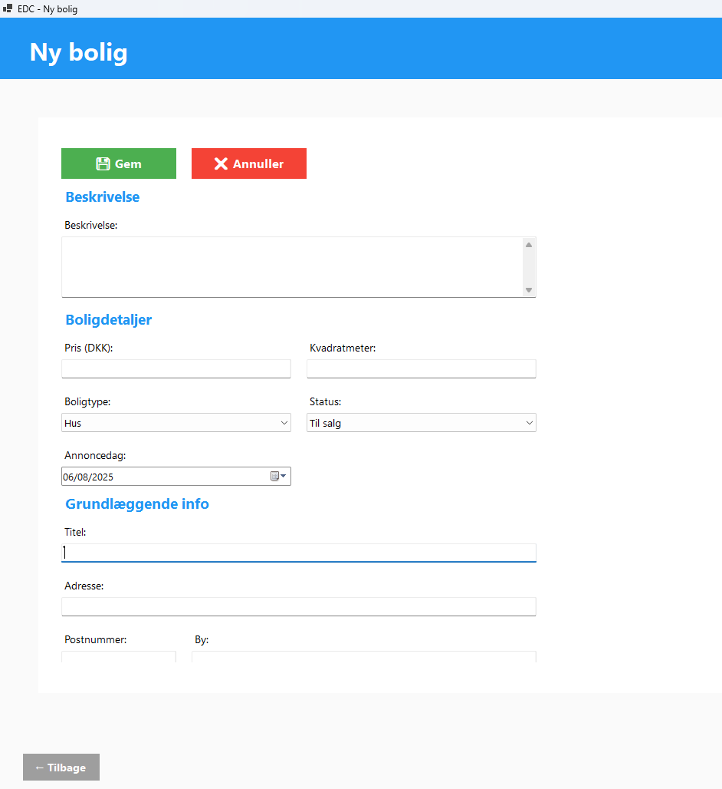

# EDC - Internal Real Estate Management System


## 📋 Project Overview
EDC is an internal real estate management system developed as a **first semester university coursework project**. This Windows Forms application provides comprehensive management of realtors, customers, and properties with a modern Danish user interface.

> **Academic Project**: This system was built as part of university coursework to demonstrate software development skills and understanding of business applications.

## ✨ Key Features

### 🏢 Core Functionality
- **Realtor Management** - Complete CRUD operations for real estate agents
- **Customer Management (Kunder)** - Buyer and seller profile management  
- **Property Management (Boliger)** - Property listings with advanced filtering
- **Data Persistence** - JSON-based local storage with async operations
- **Danish Localization** - Complete Danish language support
- **Modern UI** - Material Design with professional appearance

### 🔧 Technical Highlights
- **.NET 8.0** Windows Forms Application
- **Clean Architecture** with MVP pattern
- **Async/Await** patterns throughout
- **SOLID Principles** implementation
- **Error Handling** with user-friendly messages
- **Custom UI Components** for modern appearance

## 📁 Project Structure
```
EDC/
├── Models/           # Data models (Customer, Property, Realtor)
├── Services/         # Business logic and data access
├── Views/           # User interface forms
├── Helpers/         # Navigation and validation utilities
├── UI/              # Modern design system and components
├── Resources/       # Images and application resources
└── docs/            # Project documentation
```

## 🚀 Getting Started

### Prerequisites
- .NET 8.0 SDK or later
- Windows 10/11
- Visual Studio 2022 or VS Code

### Installation
1. Clone the repository
2. Build the project: `dotnet build`
3. Run the application: `dotnet run`

## 📸 Screenshots

*Main dashboard with navigation to all system modules*


*Create new realtor interface with validation*


*Customer creation form with buyer/seller selection*


*Property management interface with comprehensive details*

## 🎓 Academic Context
This project demonstrates:
- **Software Engineering Principles** - Clean code and architecture
- **Database Design** - JSON persistence with proper data modeling  
- **User Interface Design** - Modern, user-friendly interfaces
- **Business Logic Implementation** - Real-world application requirements
- **Documentation** - Professional project documentation

## 📋 System Requirements
- Windows 10/11
- .NET 8.0 Runtime
- Minimum 4 GB RAM
- 100 MB disk space

## 🔧 Development
```bash
# Build project
dotnet build

# Run application
dotnet run

# Create release build
dotnet publish -c Release
```

## 📄 License
This project is licensed under the MIT License - see the [LICENSE](LICENSE) file for details.

## ⚠️ Disclaimer
This is an educational project developed for university coursework. The "EDC" name is used for demonstration purposes only and is not affiliated with any real business entity. This project is intended solely for learning and portfolio demonstration.

---
**EDC Internal Real Estate Management System** - Academic project demonstrating modern software development practices.
